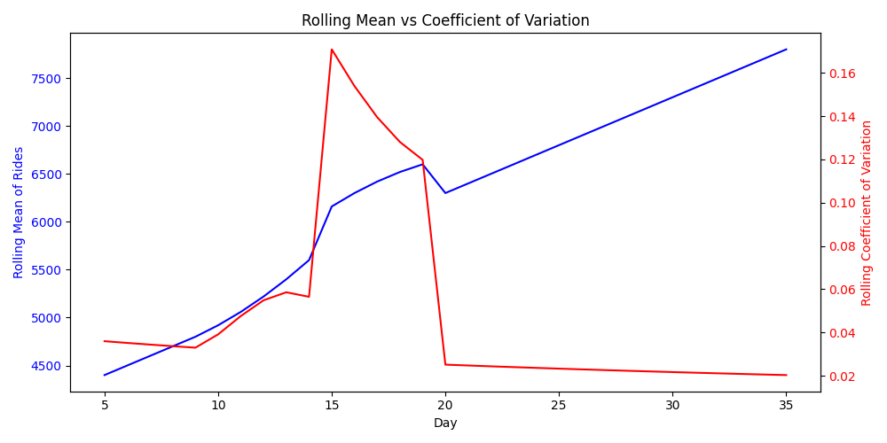

# Continuous Intelligence

This site provides documentation for this project.
Use the navigation to explore module-specific materials.

## How-To Guide

Many instructions are common to all our projects.

See
[⭐ **Workflow: Apply Example**](https://denisecase.github.io/pro-analytics-02/workflow-b-apply-example-project/)
to get these projects running on your machine.

## Project Documentation Pages (docs/)

- **Home** - this documentation landing page
- **Project Instructions** - instructions specific to this module
- **Your Files** - how to copy the example and create your version
- **Glossary** - project terms and concepts

## Custom Project

### Dataset
The dataset used in the custom project comes from transit data.
There are two columns in the dataset with 35 rows

The columns are:
- day: when the observation occurred
- rides: number of transit rides taken

### Signals
A total of four signals were created.

All four signals are a rolling statistic based on the number of rides

They are:
- rides_rolling_sum: Rolling sum of the number of transit rides
- rides_rolling_mean: Rolling average of the number of transit rides
- rides_rolling_std_dev: Rolling standard deviation of the number of transit rides
- rides_rolling_coeff_var: Rolling coefficient of variation of the number of transit rides

### Experiments
In the original script, only rolling mean was calculated, and then with my modification standard deviation was added.

For the custom project, rolling sum and rolling coefficient of variation were both added.
The sum is nice to see how many rides have happened in 35 days and the coefficient of variation allows us to look deeper into the variability of ridership.

### Results
There is a pattern of as the days increase, so does the rolling mean.  This was expected as the number of rides per day also increases as time goes on.

The rolling standard deviation mostly sits around 158 rides, but from days 10 through 19, it shoots all the way up to 1,000 and comes back down.
This is most likely due to the increase of rides per day going from 100 to 200, then from day 14 to 15, the ride count increases by 2,000.

The coefficient of variation follows a very similar pattern to the standard deviation: it sits at ~0.2-.03 most of the time but there's a large change from days 10-19.

A plot was also created to show both the rolling mean and the rolling coefficient of variation as time goes on.

The plot also shows the steady increase in mean and how days 10-19 show an increase in the stats.

### Interpretation
In the 35 days that the number of rides were recorded, there was something that happened between days 10-19 that caused a great surge of riders.

We can also tell that if the data were to of continued, there would still be a steady increase in riders.

In business terms, demand is increasing, so ride companies would profit from both making rides more convenient to access and more expensive.

## Additional Resources

- [Suggested Datasets](https://denisecase.github.io/pro-analytics-02/reference/datasets/cintel/)
